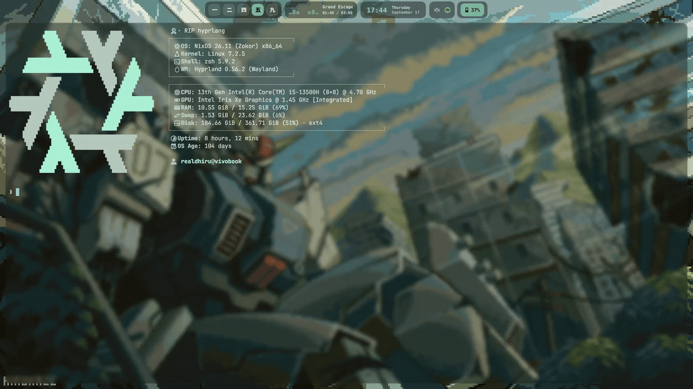

# ❄️ Declarative NixOS & Hyprland Rice

<div align="center">

[](https://nixos.org)
[](https://hyprland.org)
[-8338EC?style=for-the-badge)](https://git.outfoxxed.me/outfoxxed/quickshell)
[](https://github.com/InioX/matugen)
[](https://wiki.nixos.org/wiki/Flakes)

<p align="center">
  A declarative, reproducible personal desktop environment configured with Nix Flakes, Hyprland, and QuickShell.
</p>

</div>

---

## Showcase

<div align="center">

### Desktop & Interface
<video src="https://github.com/Realdhiru/nix/raw/main/docs/assets/hero_desktop.mp4" poster="docs/assets/hero_poster.jpg" autoplay loop muted playsinline width="850">
  
</video>

<br/>

<sub>Wallpapers used in this setup are available in [Realdhiru/wallps](https://github.com/Realdhiru/wallps). Base desktop widgets were adapted from [ilyamiro/serpantinum](https://github.com/ilyamiro/serpantinum).</sub>

</div>

---

## Design & Technical Highlights

### Power & Thermal Management
- **Hardware-Level Power Authority**: TLP coordinates CPU energy-performance preferences (EPP), ASPM, and platform profiles, while enforcing an 80% battery charge ceiling (`charge_control_end_threshold = 80`) directly at the firmware level to preserve cell health.
- **Dynamic GPU Shader Bypass**: On battery-saver profiles or solid black wallpapers, compositor dual-kawase blur shaders and drop shadows are automatically bypassed with 100% opaque window rendering, eliminating multi-pass GPU alpha-blending.
- **Event-Driven Telemetry (Zero Polling Loops)**: System telemetry reads directly from Linux kernel uevents and sysfs watchers rather than periodic shell polling timers. In-process `/proc` inspection in background daemons eliminates unnecessary subprocess forks, allowing CPU package states to settle into deep C-state sleep.
- **Transient Spike Control**: Disables aggressive dynamic frequency boost on battery to eliminate thermal spikes from background Chromium and Electron processes.

### Compositor & Desktop Workflow
- **Modular Lua Configuration**: Hyprland configuration is organized cleanly in native Lua modules (`hyprland.lua`), decoupling keybinds, rules, window animations, and environment variables.
- **Frame-0 Hot Reloading**: Synchronously evaluates cached power and visual states at startup and reload (`SUPER + R`), applying compositor rules in ~15ms without unmapping Wayland surfaces or cold-restarting desktop shell widgets.
- **Low-Latency Compositing Mode**: A dedicated keybind (`SUPER + SHIFT + G`) toggles Direct Scanout (`render:direct_scanout = 2`), Adaptive Sync (VRR), and asynchronous tearing for latency-sensitive full-screen workloads.
- **Pure Wayland Pipeline**: All Chromium and Electron apps run with native Wayland flags (`NIXOS_OZONE_WL = "1"`), providing kinetic touchpad gestures and subpixel scrolling.
- **Fuzzy File Navigation & Theming**: Centered interactive file search (`SUPER + SPACE`) with instant parent directory navigation in `pcmanfm-qt`, paired with in-place Matugen palette syncing across widgets, terminal, and launcher.

### Declarative System Infrastructure
- **Safety-Gated Rebuild Workflow**: A custom rebuild pipeline validates builds before activation, runs a post-switch health gate with automated rollbacks, and retains a 14-day garbage collection safety window while tracking floating `nixos-unstable`.
- **Integrated System Packaging**: Declarative custom derivations (including `hypr-kdeconnect-portal` for remote input over `/dev/uinput`), native AppImage execution via Linux kernel `binfmt_misc`, and declarative Flathub integration.
- **Clean Display Authentication**: Lightweight TTY display manager (`ly`) with PAM authentication, cleanly decoupling graphical login from session startup.

---

## Architecture & System Structure

```text
nix/
├── flake.nix                          # Flake entrypoint, nixpkgs-unstable & community inputs
├── flake.lock                         # Deterministic input lockfile
├── home.nix                           # Home Manager root configuration
├── pkgs/                              # Custom Nix package derivations & patches
│   ├── buuf-nestort.nix
│   ├── hypr-kdeconnect-portal.nix
│   └── pcmanfm-qt-appid.patch
├── hosts/
│   └── nixos/
│       ├── default.nix                # Host-level imports & machine metadata
│       └── hardware-configuration.nix # Kernel modules, filesystems, and hardware drivers
├── modules/
│   ├── system/                        # Declarative NixOS system services
│   │   ├── asus-brightness-rebind.nix # Hardware brightness hotkey mapping
│   │   ├── boot.nix                   # systemd-boot EFI & kernel parameter tuning
│   │   ├── fonts.nix                  # CJK, monospace, and Nerd Font typography
│   │   ├── gaming.nix                 # Low-latency gaming kernel & graphics stack
│   │   ├── memory.nix                 # ZRAM & memory pressure handling
│   │   ├── packages.nix               # System-wide CLI & GUI package manifests
│   │   ├── power.nix                  # TLP power management & battery charge thresholds
│   │   ├── services.nix               # NetworkManager, PipeWire, udev, & D-Bus daemons
│   │   └── users.nix                  # User account privileges & sudo rules
│   └── home/                          # User-space Home Manager modules
│       ├── desktop-entries.nix        # Curated application launcher overrides
│       ├── shell.nix                  # Zsh environment, custom rebuild() gate & aliases
│       ├── spicetify.nix              # Declarative Spotify theming
│       ├── theme.nix                  # GTK, icon, and cursor theming
│       └── vscodium.nix               # VSCodium configuration & extensions
├── dotfiles/                          # Symlinked user configuration tree
│   ├── fastfetch.jsonc                # System info presenter
│   ├── starship.toml                  # Minimal shell prompt
│   ├── wezterm.lua                    # Hardware-accelerated GPU terminal
│   ├── fuzzel/
│   │   └── fuzzel.ini                 # 2x HiDPI centered application & file launcher
│   ├── matugen/                       # Dynamic color extraction config & templates
│   └── hypr/                          # Hyprland Wayland compositor configuration (Lua)
│       ├── hyprland.lua               # Compositor core entrypoint
│       ├── appearance.lua             # Dual-kawase blur, shadows, and smooth Bezier curves
│       ├── keybinds.lua               # Window management, workspace & utility keybindings
│       ├── rules.lua                  # Window rules & Frame-0 opacity evaluation
│       ├── scripts/                   # Performance toggles & helper utilities
│       └── scripts/quickshell/        # Curated QuickShell QML widget suite
│           ├── Shell.qml              # Wayland layer-shell root entrypoint
│           ├── TopBar.qml             # Status bar (Kanji workspaces, clock, tray, battery)
│           ├── SysData.qml            # Hardware telemetry & live profile listener
│           ├── battery/               # Control center popup (power, brightness, audio, actions)
│           ├── network/               # Wi-Fi network panel & hotspot controller
│           ├── music/                 # MPRIS media player drawer
│           └── watchers/              # Event-driven udev and PipeWire stream watchers
└── docs/
    ├── decisions.md                   # Chronological architectural & engineering rationale
    ├── flow.md                        # Emergency recovery & runtime flows
    └── assets/                        # High-resolution showcase media
```

---

## Setup & Reproduction

### 1. Prerequisites (Fresh Machine)
Ensure NixOS is installed and Flakes are enabled in `/etc/nixos/configuration.nix`:
```nix
nix.settings.experimental-features = [ "nix-command" "flakes" ];
```

### 2. Clone & Adapt Hardware
```bash
git clone https://github.com/Realdhiru/nix.git ~/nix
cd ~/nix

# Generate hardware configuration for the target machine
nixos-generate-config --show-hardware-config > hosts/nixos/hardware-configuration.nix
```

### 3. Initial Build & Activation
```bash
# Build and activate the configuration
sudo nixos-rebuild switch --flake .#nixos
```

### 4. Custom Management Commands

The shell environment (`modules/home/shell.nix`) provides a dedicated suite of workflow functions to manage, inspect, and maintain the system safely:

#### `rebuild [commit message]`
The primary command for applying configuration changes. It implements an automated health-gated safety pipeline:
1. Records the previous known-good system generation and git revision to `~/.cache/nix_rebuild_log`.
2. Creates an atomic `known-good` git tag and automatically stages/commits all modified files.
3. Executes `sudo nixos-rebuild build --flake .#nixos`. If compilation fails, execution aborts immediately without activating anything.
4. Switches to the new generation and executes `scripts/health-check.sh` (validating Hyprland session integrity and GPU-hang probes).
5. If a critical failure is detected, it **automatically rolls back** to the previous generation, preserves the failed generation in the bootloader for debugging, and generates a diagnostic log.

```bash
# Example: Apply changes with an automated commit & health check
rebuild "feat: adjust hyprland window rules"
```

#### `update`
Pulls the latest git changes, updates flake inputs to the latest `nixos-unstable` revision, and executes a verified rebuild:
```bash
update
```

#### `gens`
Displays an annotated, color-coded list of all system generations present in `/nix/var/nix/profiles/`, highlighting the currently `[ACTIVE]` generation and any `[PINNED STABLE]` generations:
```bash
gens
```

#### `pin-stable [generation_number]`
Pins a specific generation (or the currently active generation if no argument is passed) as a permanent GC root (`/nix/var/nix/gcroots/boot-stable`). Pinned generations are permanently protected from garbage collection:
```bash
# Pin current generation
pin-stable

# Pin specific generation (e.g. generation 835)
pin-stable 835
```

#### `clean`
Safely purges unpinned Nix store paths older than 14 days (`--delete-older-than 14d`), ensuring that rollback targets and recent known-good generations remain fully bootable:
```bash
clean
```

#### `ff` & `af`
- **`ff`**: Quick alias for `fastfetch`.
- **`af`**: Interactive animated terminal fetcher that cycles through GIFs/MP4s in `~/Pictures/fastfetch` using `anifetch`, dynamically calculating terminal cell aspect ratios (`ffprobe`) to prevent image distortion.